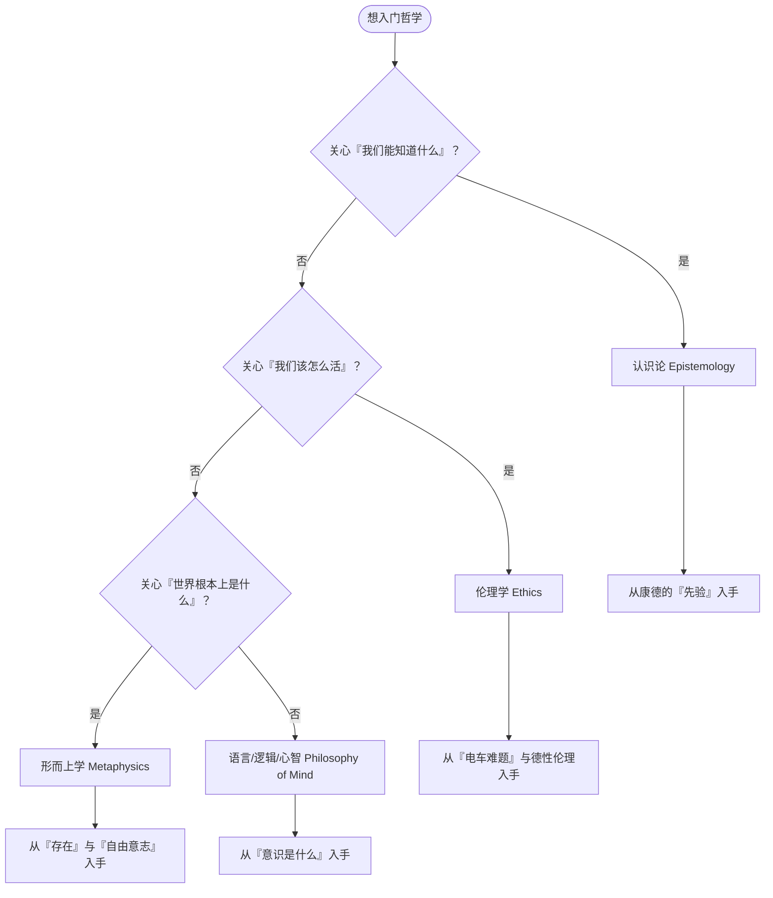

# 哲学学习路线图（初稿）

不是所有人都该从古希腊顺读到当代。更自然的入口是：**先问自己，你最被哪种问题吸引？**

## 三条建议

1. **跟着问题走**，而不是跟着哲学家的生平走。
2. 每条路先读 [概念](/concepts/) 里对应的入门词，再碰原典。
3. 读不下去就换一条路——哲学的分支之间是通的，不必死磕。

<OrganizerNote title="路线图说明">
这张图是**初稿**，会随着我自己学习的推进不断修正。它不代表"正确路径"，只代表"一种可行的、对初学者友好的切入方式"。
</OrganizerNote>
